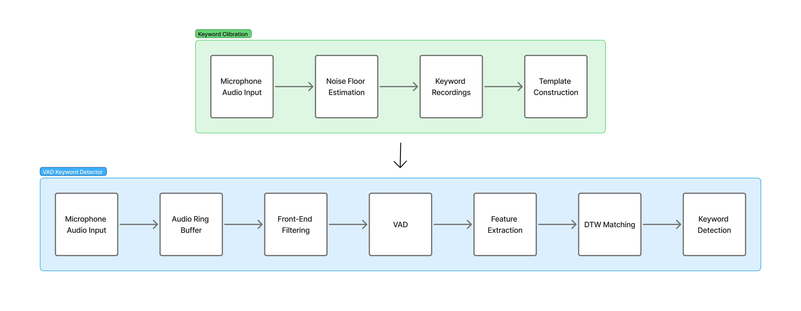
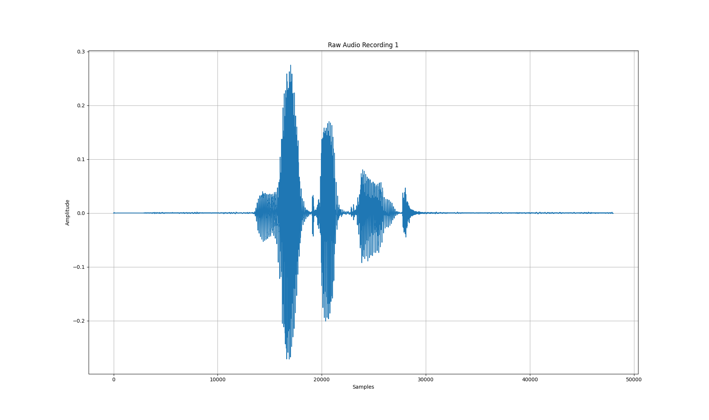
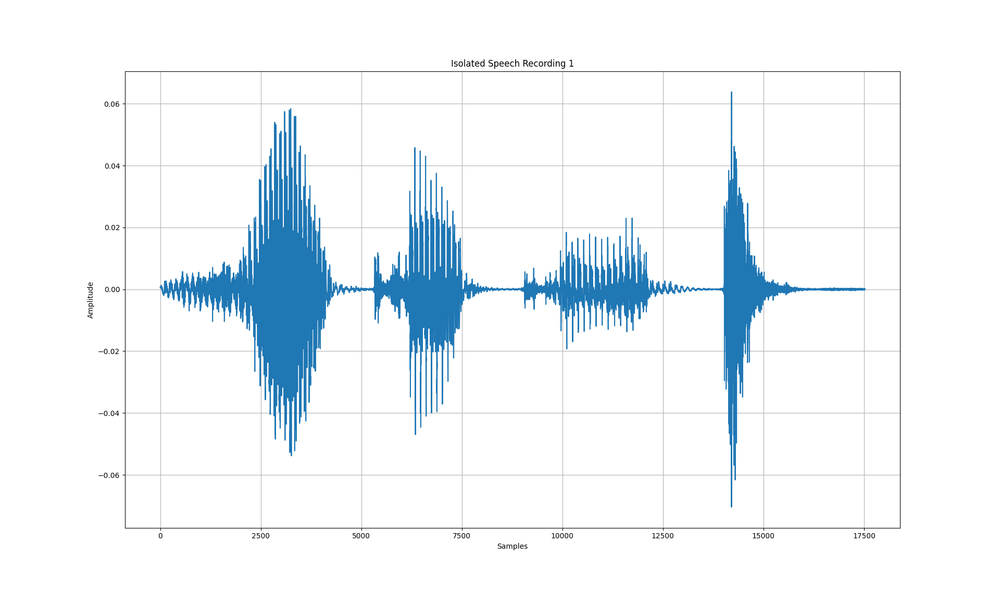
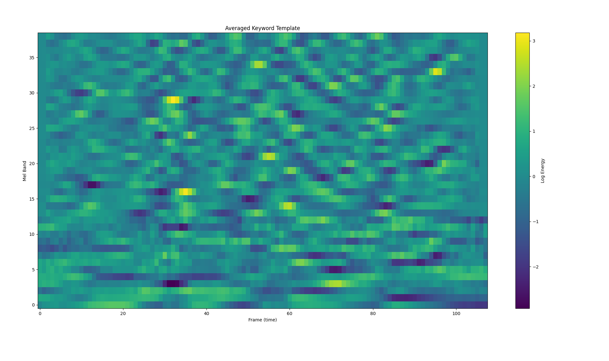
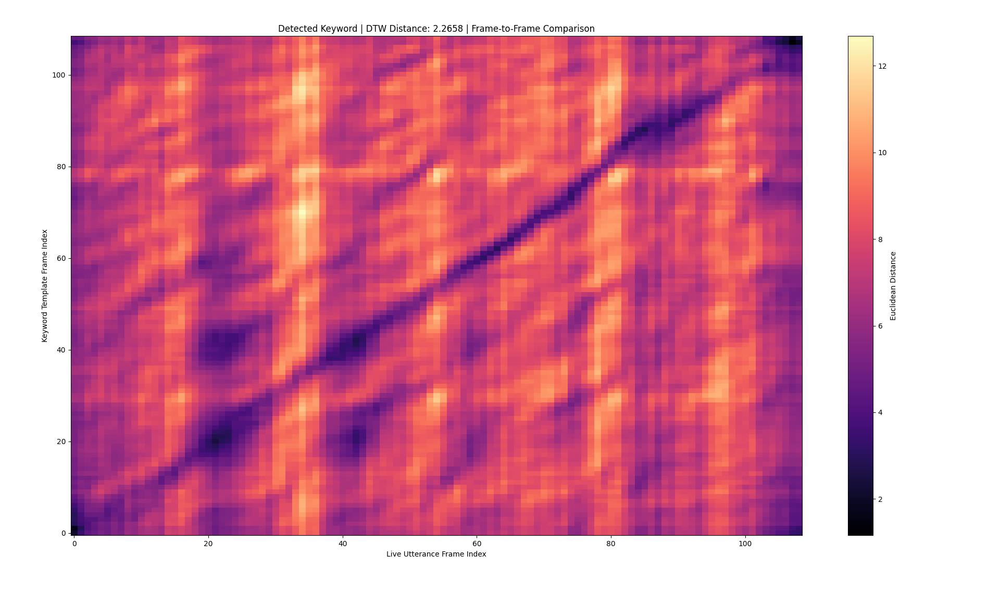
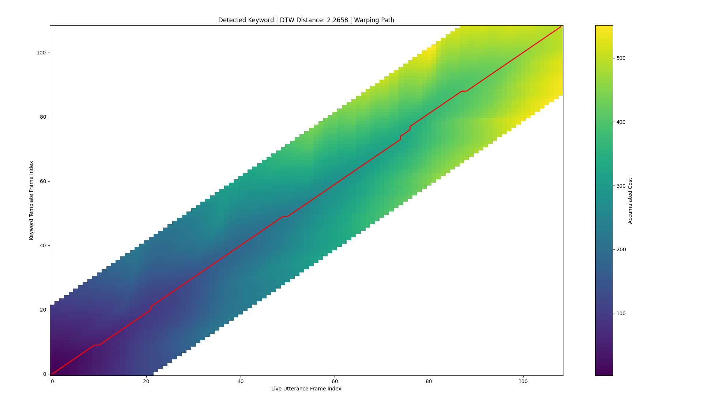
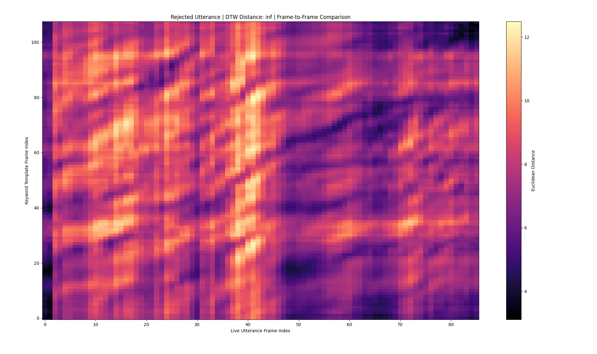
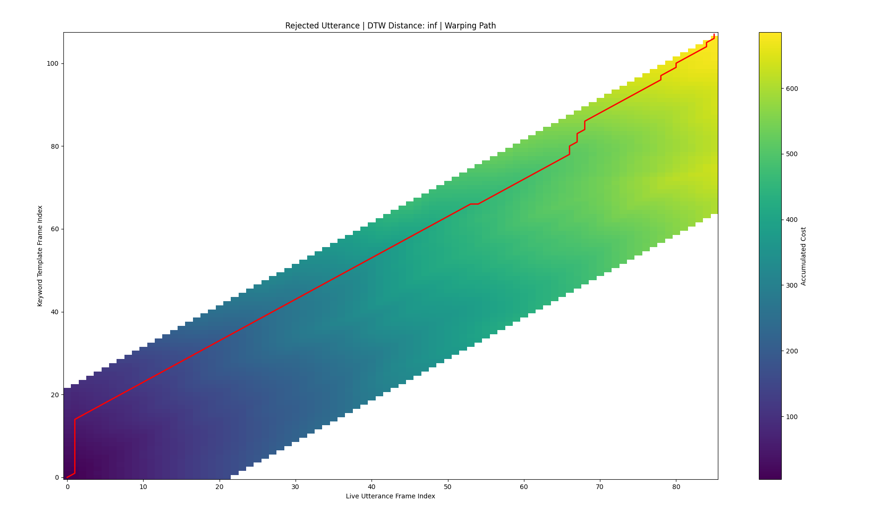

# Overview

The goal of this project was to create a keyword detection application without any AI speech/keyword models. In the present day, the immediate method of implementing this type of project would be to train a model, and let it detect the keywords we care about. I wanted to try something a little different, and implement keyword detection using signal processing methods, catching similarities  when analyzing different signal characteristics from input audio data. While I don't expect this implementation to be more accurate than an AI model, I'd hope I can learn more about signal processing this way.

The overall structure involves a calibration phase, then a live-monitoring phase. Users are asked to say the keyword, the features of that keyword is processed, and then in the live-monitoring mode, attempt to detect the same keyword.

# Architecture

### Audio Pipeline



_**Figure 1**: Audio Pipeline Block Diagram_

The full audio pipeline involves a keyword calibration stage, with 4 main stages, and a live monitoring phase, with 7 main stages, shown in the figure above. Detailed implementation notes are outlined below.

### Project Setup

```
main.py
├── Calibration (blocks/calibration.py)
│   ├── KeywordAudioSetup→AudioStream→AudioRingBuffer  (audio/capture.py)
│   ├── AudioFilter                                    (audio/filter.py)
│   ├── VoiceActivityDetection                         (processing/vad.py)
│   └── Features                                       (processing/features.py)
│
└── Monitor (blocks/monitor.py)
    ├── AudioStream→AudioRingBuffer                    (audio/capture.py)
    ├── AudioFilter                                    (audio/filter.py)
    ├── VoiceActivityDetection  [from Calibration block]
    ├── Features                [from Calibration block]
    └── DTW                                            (processing/dtw.py)
```

# Implementation

### Calibration

#### Noise Floor Estimation

In the beginning of the calibration stage, the application records a snippet of audio, assuming the user is not speaking, to estimate the noise floor of the environment the user is in. This is to ensure that when the user speaks, we can detect voice activity, and not confuse background noise for speech.

By default, the application records 3 seconds of ambient audio at 16kHz, and we measure the energy and spectral entropy of the recording.

**Spectral Entropy** provides us a measure of how spread out the power spectrum is. This is useful because we would expect speech to be more structured in the frequency spectrum. Speech is more ordered, being delivered across structured consonants and vowels, therefore we would likely see lower entropy in the frequency domain.

**Energy** is simply the mean squared amplitude of the signal. This provides us with an average noise level across the ambient recording. If the user speaks, we are assuming that the speech would be louder than the background noise, hence, the energy would be higher.

This noise floor recording is passed through some filtering that is applied to all audio in this application. The first filter is for DC offset, which removes any baseline wander. The second filter is a Butterworth bandpass filter, which keeps signals within the frequency range we care about, which is standard from 80Hz to 8kHz, but since our sampling rate is 16kHz, the top cutoff was set to 7kHz to be below the Nyquist limit. Finally, a pre-emphasis block balances the feature detection of vowels and consonances. We expect vowels to have high energy, and live at lower frequencies, while consonances have lower energy, and live at higher frequencies. The pre-emphasis block manipulates the signal by scaling the output based on the frequency of changes in the signal. If the signal changes faster, the difference between a current sample and the previous is larger, therefore the output is larger. For vowels, the frequency is lower, therefore the change between samples is lower, which reduces the output on low frequencies. This together balances the weight/influence of vowels and consonances on feature extraction on audio data.

From these noise recordings, we assume that the ambient noise levels are lower than when the user is speaking, and when the user does speak, the audio data has higher energy, and lower entropy. Therefore, from personal testing and simple configurations, we have designed a simple VAD. If the energy is 50 times greater than the average noise floor energy, and the entropy is lower than the average noise floor entropy, we deduce that the user is speaking.

#### Keyword Recordings

Next, the application requests that the user state the desired keyword into the microphone three times, each with a 3-second window to do so. Each recording is fed through the filtering steps defined above, and using the simple VAD we created, we crop the three recordings to only keep audio that we deduced is speech. This is done over 25ms windows with 10ms hops, and the first window of detected speech is set as the start of the keyword utterance, and the first instance where speech is no longer detected is set as the end of the keyword utterance.

Once these keyword recordings are filtered, cropped, and framed with tags of beginning and ends of keyword utterances, we have more reliable samples of data to extract features. When the live monitor is active, we know what length of keyword we are looking for. Examples of the raw and cropped keyword audio recordings are shown in Figure 2 and 3.



_**Figure 2:** Un-cropped Recording of Keyword Utterance "VocalPoint"_



_**Figure 3**: Cropped and Filtered Recording of Keyword Utterance "VocalPoint"_

#### Keyword Signal Characteristic Template Construction

From the three recordings of the keyword, we extract features that would allow us to compare and detect the keyword during live audio monitoring. The main step f capturing features using **MFCCs**.

The first step is to segment the cropped keyword recording into 25ms windows, with 10ms hops between windows. We apply a **hamming window** to each frame to reduce spectral leakage, and we then apply a 512 point FFT on each frame. With the power spectrum of a single frame, we perform a mel filter bank projection. As learned in class, this is used to scale the frequency resolution of human hearing. We project onto 40 triangular mel filters from 80 Hz to 7kHz, and ideally extracts a more meaningful overall spectral structure of each frame. We then take the log of these mel energies.

Next, we apply a **type II discrete cosine transform**, which we know only uses cosine basis functions for less correlation when compared to a DFT operation. We end up with 40 MFCCs, but we only take the first 13 coefficients based on the heuristic from class slides.

An additional feature included in this application is the calculation of the first and second order derivatives of the MFCCs. This outputs delta features of the keyword recording, extracting spectral behaviour in the keyword based on how features change over time, in but velocity and acceleration. This adds an extra layer of features for more robust keyword detection. In this application, a width of 2 is used for the delta estimation, and each frame is normalized; increasing this width can reduce the influence of noise, but we may lose less resolution in rapid spectral changes.

This provides us with 13 MFCCs, 13 delta features, and 13 delta-delta features, totalling **39 features per frame**.

Because each recording of the keyword utterance is not exactly the same, we resample each recording to a median length so that every recording is identical in length, which allows us to average these features across the three recordings. This ideally removes some variation between recordings, as well as capture a more average waveform/feature of the keyword, rather than catching specific details within a single utterance of the keyword. This results in a single keyword template, with [(N# 25ms frames) * 39] features. This template captures both spectral and temporal features of the keyword, but it is important to note that it is specific to the speaker, and even then, possibly very sensitive to tonal changes. If users utter the word in a deeper or higher tone, the differences in features may cause the detector to not catch the keyword.



_**Figure 4**: Keyword Template for "VocalPoint" Utterance_

### Live Audio Monitoring / Keyword Detection

#### Audio Input

The signal input is from the host device's audio input source, reading single-channel microphone audio continuously. Again, audio is sampled at 16 kHz, based on the standard 8-16kHz sampling frequency for speech processing as defined in class.

#### Audio Ring Buffer

The ring buffer is used to have a reliable and continuous pool of audio data for later stages of the pipeline to read from. This is designed as a circular ring buffer with 3 second capacity. New data overwrites older data, and provides the system with constant live audio data. The 3 second buffer size is just a estimated default value.

#### Filtering

The live monitor maintains a 25ms buffer for VAD analysis, which hops for every 10ms. This 10ms frame is filtered with causal filters, being passed through Butterworth filter (80Hz -> 7kHz), DC offset removal, and pre-emphasis. These filters are similar to the ones used in the calibration, but updated to be causal and applicable in a 10ms frame. This filtered audio frame is pushed to the 25ms buffer for VAD detection, as well as the 3 second buffer.

#### VAD and Speech Monitoring

The 25ms VAD buffer is monitored by the VAD process. It uses the same VAD thresholds using energy and entropy as the calibration stage. The audio input state can be SPEECH, HANGOVER, or SILENCE. If the system detects speech, it will monitor how long speech continues to occur as it continues to process more 25ms frames. We save the length of time the audio input state is continuously determined to be speech.

The **hangover** feature that prevents choppy VAD detections, such as quieter segments in speech of utterances. A low threshold of the VAD is used, and if the audio input is continuously below this threshold, there is a max number of frames of hangover, 5 by default, before the VAD deems the audio input as no longer speech. Longer hangover frames mean longer segments of silence before the VAD changes the audio input state from speech to silence. If the number of hangover frames decreases, the VAD may deem speech has ended even when a user is still uttering a single word, since its more sensitive to silence.

When the live monitor detects that the audio input state has transitioned from hangover to silence, it checks how long the recent speech segment was. If the length of speech is more than half the time of the length of the keyword from the calibration stage, we call the later stages to extract features on that speech segment and determine if that segment was the keyword or not. We set this length of speech threshold to ensure that short bursts of "speech" audio that may arrive from noise or background bursts are not being passed into the feature extractor. If the threshold is too long, and too close to the length of the calibrated recordings, if the user says the keyword too quickly, it may not be passed to the feature extractor to be detected

#### Feature Extraction

When a segment of live audio is determined to be speech for a long enough period of time, it is passed on to be processed for feature extraction. The entire segment of audio that was set as SPEECH is fed through the same pipeline used to extract features in the calibration stage. It is segmented into 25ms frames with 10ms hop, each frame projected to 40 mel filter banks, and we extract 39 features (13 MFCCs, 13 delta coefficients, 13 delta-delta coefficients).

#### DTW Matching

The extracted features of the live audio segment is compared with the saved features of the keyword collected during the calibration stage. This is done using **dynamic time warping (DTW)** matching, which is a concept I was most unfamiliar with in this project. When the user utters the keyword, it will never be exactly like the averaged features extracted during calibration, so we can't compare the features frames 1-to-1. There will also be differences in length, how different sections of the keyword are uttered, and more. DTW allows for the manipulation of the time axis to align the two features for better comparison.

For every feature frame from both the live segment and the calibration segment, a **euclidean distance** is calculated, to determine how similar those frames are to each other, which is shown in Figure 5 from a successful keyword utterance detection. These pairs of frames and their euclidean distances are then passed to a **cost matrix**, which compares how similar the features of the two segments are. If the two segment features are similar, there will be some low-cost path through the matrix. This path is the warping path. When the path is diagonal, the frames are 1-to-1, when it is vertical, it is stretching time in one of the segments, and when horizontal, it is stretching time of the other segment. This warping path travels across the cost matrix, finding the frame that best matches a corresponding frame from the two segments. Ideally, if the two segments are similar and truly the same keyword, we expect a low-cost path, with a fairly smooth diagonal line across the cost matrix. An example cost matrix from an utterance that was detected during live monitoring that was successfully detected is shown in Figure 6. To prevent very different features from being aligned with each other, a **Sakoe-Chiba band** constraint is applied to limit stretching to 20% of the sequence lengths.



_**Figure 5**: Euclidean Distance Frame Comparison of Detected Utterance "VocalPoint"_



_**Figure 6**: Cost Matrix Warp Path of Detected Utterance "VocalPoint"_

Utterance of the word "Pizza Time" that was not the keyword and successfully rejected are shown in Figures 7 and 8. The keyword is still "VocalPoint"



_**Figure 7**: Euclidean Distance Frame Comparison of Rejected Utterance "Pizza Time"_



_**Figure 8**: Cost Matrix Warp Path of Rejected Utterance "Pizza Time"_

The final output is a DTW score or distance, which is normalized across the two segments.

#### Keyword Matching

The DTW distance is compared to a detection threshold, which is currently set to 3.0 by default. If the DTW distance value is less than 3.0, we determine that the audio segment was a successful detected utterance of the keyword. If it is larger than 3.0, than the speech segment was not the keyword. This threshold of 3.0 was only chosen from personal testing, as it was a value that provided confidence in successful utterances, and rejected incorrect words. Future updates should create a dynamic threshold that is based on the noise floor and specific features of the keyword.

# Results

Based on testing of different words, and using "VocalPoint" as the keyword, this keyword detection application works well. The accuracy of the application depends extremely heavily on the calibration stage. If there are weird artifacts in the noise floor estimation, or if the keyword recordings aren't consistent or similar, the live monitoring fails to detect anything. Additionally, when there is more noise in the background, unstable noise such as kitchen noises, inconsistent bursts of conversation, the application does not work as well.

It should also be noted that the detection is still just capturing the 39 features of frames within the audio data, which isn't enough to truly "capture" the keyword. The user must speak the keyword at a fairly similar pace and tone as the calibration recordings, and other users most likely cannot be detected if they speak the same keyword simply due to difference in pitch and other speech characteristics.

# Future Work

Perhaps the best validation for a tool like this is to compare it to an AI implementation performing the same task, and monitor accuracy as well as computation/power usage. With a given weight/scale for accuracy and power usage, the implementation that earns the highest score would be deemed better.

False rejection rates and false acceptant rates need to be further tested, and should be compared against academic/industry metrics for acceptable performance for similar applications. This testing should also include comparisons given noise floor, user speech characteristics, and keyword characteristics.
